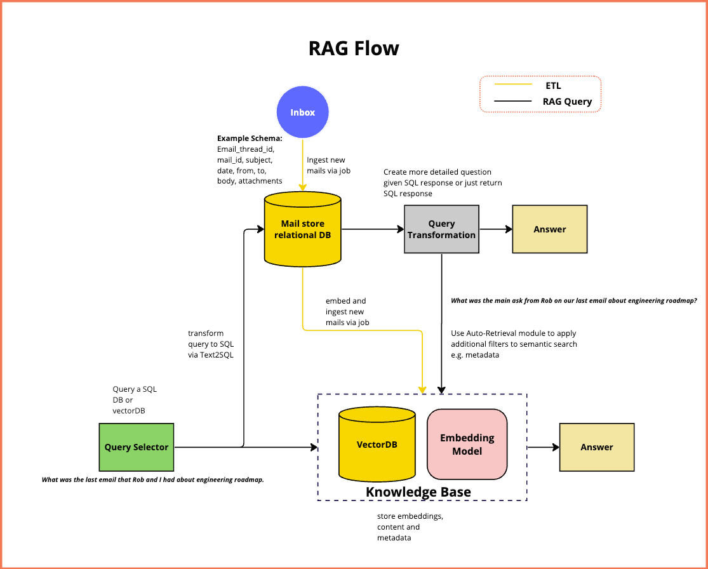

# Email RAG

Repo to try and build an incredible RAG system over email **(this is to test the SOTA in RAG)**

RAG over conversational data is an interesting topic to us, because, we all have access to these datasets, and we can apply our intuitions to what feels useful and what is not.

## Email as a database of documents + metadata:

If you You could imagine a tabular view of email, it would have something, like the following columns:

```
email_account, thread_id, subject, date, from, to, body, attachments
```

## Types of problems to solve

These datasets are interesting because they come with various challenges, 

* Security: How can one build one system that works independent partitions [email_account], and data is not breached from one to the other.
* Cardinality: Depending on the types of questions one needs to answer. The answer maybe a find operation [Retrieval] or a single answer [Retreival Augmented Generation], in one or many documents that can be grouped differently depending on the question too.


### Cardinality:

* **Single document:**  When everything we need to get to the answer is in one single document

  **[RETRIVAL]** Get me the last message that Rob and I had about engineering roadmap.

  **[RAG]** What was the main ask from Rob on our last email about engineering roadmap?

* **Single thread:** When everything we need is in a single email thread (and email that and its responses, each email can have attachments), lets limit attachments to (PDFs, spreadsheets, word documents, or images)

  **[RAG]** What were the differences in the engineering budget I proposed vs the other budgets proposed for 2024 in the last email thread about engineering planning with Rob and Anna? 


* **All documents**  When the information to answer a question, can be spread across all messages

  **[RETRIEVAL]** Find me emails that sound legitimate that don’t sound like spam or unsolicited services that I haven’t responded to yet with whom I have had conversations already?
  
  **[RAG]** From the conversations between me and Claudia, tell me what are Claudia’s kid’s names, ages and birthdays if possible?


Tools that we will be possibly using:

* **For guardrails:** https://github.com/NVIDIA/NeMo-Guardrails?utm_source=www.turingpost.com&utm_medium=referral&utm_campaign=8-open-source-tools-for-retrieval-augmented-generation-rag-implementation


## High Level Design

