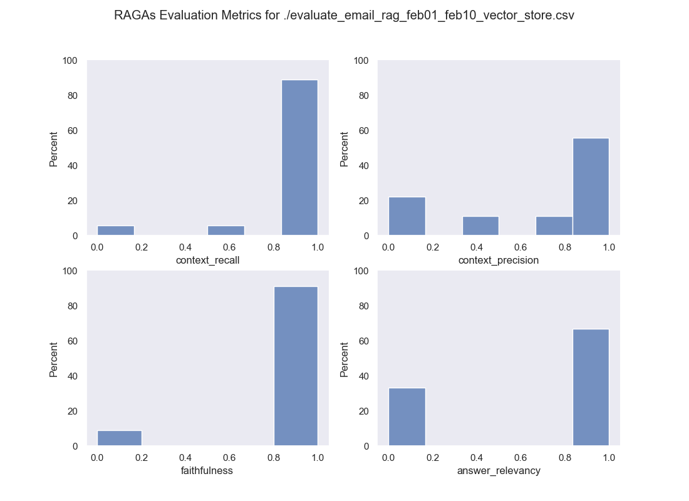

# Email RAG

Repo to try and build an incredible RAG system over email **(this is to test the SOTA in RAG)**

RAG over conversational data is an interesting topic to us, because, we all have access to these datasets, and we can apply our intuitions to what feels useful and what is not.

## Email as a database of documents + metadata:

If you You could imagine a tabular view of email, it would have something, like the following columns:

```
email_account, thread_id, subject, date, from, to, body, attachments
```

## Types of problems to solve

These datasets are interesting because they come with various challenges, 

* Security: How can one build one system that works independent partitions [email_account], and data is not breached from one to the other.
* Cardinality: Depending on the types of questions one needs to answer. The answer maybe a find operation [Retrieval] or a single answer [Retreival Augmented Generation], in one or many documents that can be grouped differently depending on the question too.


### Cardinality:

* **Single document:**  When everything we need to get to the answer is in one single document

  **[RETRIVAL]** Get me the last message that Rob and I had about engineering roadmap.

  **[RAG]** What was the main ask from Rob on our last email about engineering roadmap?

* **Single thread:** When everything we need is in a single email thread (and email that and its responses, each email can have attachments), lets limit attachments to (PDFs, spreadsheets, word documents, or images)

  **[RAG]** What were the differences in the engineering budget I proposed vs the other budgets proposed for 2024 in the last email thread about engineering planning with Rob and Anna? 


* **All documents**  When the information to answer a question, can be spread across all messages

  **[RETRIEVAL]** Find me emails that sound legitimate that don’t sound like spam or unsolicited services that I haven’t responded to yet with whom I have had conversations already?
  
  **[RAG]** From the conversations between me and Claudia, tell me what are Claudia’s kid’s names, ages and birthdays if possible?


## High Level Design


## Methodology

Our approach on enterprise ready RAG for emails is metrics driven. Specifically, we're using the [RAGAs library](https://docs.ragas.io/en/latest/concepts/metrics/index.html) to evaluate key metrics:
- Retrieval metrics:
    - **Context precision** (signal to noise ratio of retrieved content)
    - **Context recall** (ability to retrieve *all* relevant information to answer the query)
- Generation metrics:
    - **Faithfulness** (how factually accurate the answer is)
    - **Answer relevancy** (how relevant is the generated answer to the query)

The `evaluate_rag.py`, `visualize/visualize.py`, and `ingest.py` modules can be used to experiment with ingesting (real or test) email/document data, and evaluate RAG pipelines against Q&A datasets in `data/` subdirectories.

### E2E Email Evaluation

For testing with personal emails, you need to do create/generate a Q&A dataset for your emails in a new `data/` subdirectory. See [blockchain_solana dataset](https://github.com/mindsdb/email_rag/blob/main/data/blockchain_solana/rag_dataset.json) for an example `rag_dataset.json` file.

We provide various other datasets in `data/` subdirectories (email & documents) to evaluate against as well.

Then, you can run `evaluate_rag.py`:

`python ./evaluate_rag.py --dataset=<YOUR_CUSTOM_EMAILS> --retriever_type=<vector_store, auto, sql, multi>, --input_data_type=email --show_visualization=true`

This will ingest your emails from the last 10 days, and use the chosen RAG pipeline to test Q&A performance against the provided dataset. Results will be (optionally) shown as a [Seaborn](https://pypi.org/project/seaborn/) plot, and saved as a `.csv` file locally.

Different types of retrievers can be found in the [retrievers subfolder](https://github.com/mindsdb/email_rag/tree/main/retrievers).

### Metrics Visualization

The module `evaluate_rag.py` has a `--show-visualization` option, but you can use `visualize/visualize.py` to view previously saved metrics evaluation `.csv` results:

`python ./visualize/visualize.py --path=./evaluation_feb.csv`

Here is an example visualization with a simple `auto` retriever type on some private emails + Q&A dataset from February:



### Ingest Emails Separately

Sometimes, you want to ingest a specific subset of your emails, and then evaluate them separately. For example, you could ingest all of your February 2024 emails, and store them as a `.csv` or vector store to evaluate later with `evaluate_rag.py`.

`python ./ingest.py --since_date=2024-02-01 --until_date=2024-03-01 --output-path=./data/personal_emails/feb_emails.csv`.

You can additionally store the emails in `Postgres` with `pgvector` instead by specifying `--connection-string` and `collection-name` arguments.

Then, you can evaluate separately:

`python ./evaluate_rag.py --dataset=personal_emails --retriever_type=multi, --input_data_type=file --show_visualization=true`

### Load Data from existing Vector Store

If you have already ingested your emails into a vector store, you can connect to it and load into the RAG pipeline for evaluation:

1. Copy .env.example file to .env file `cp .env.example .env`
2. Fill in the .env file with your vector store connection details
3. Run the following command

`python ./evaluate_rag.py -d test_existing_vector_store -i vector_store --existing_vector_store true` 

NB it will run up to evaluation part, it will fall over at evaluation part as expected as qa dataset is not provided

It is not working well with PGVector, the reason being is LangChain requires the data to be stored in a particular way for it to be loaded. Therefore, its recommened to use ChromaDB for the time being.
see https://www.reddit.com/r/LangChain/comments/18lodyx/is_it_even_possible_to_initialize_vector_stores/
